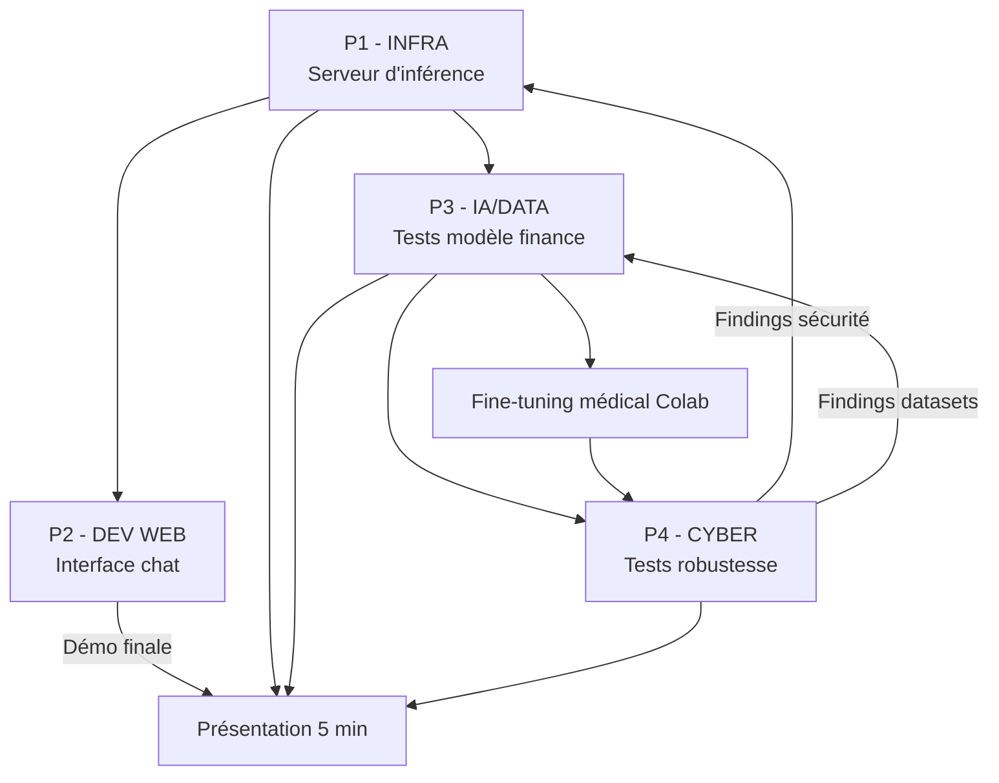

# Plan d'exécution — Challenge IA TechCorp (7h)

**Équipe : 4 personnes**  
**Durée : 7 heures**  
**Objectif principal :** déployer Phi-3.5-Financial avec une interface chat professionnelle, tout en validant l'intégrité de l'héritage laissé par l'équipe précédente.

---

## 1. Contexte

TechCorp Industries vous confie le relais d'un projet compromis. L'équipe précédente a été licenciée pour soupçon de compromission du code et des données.

Votre mission en deux volets :

| Priorité          | Mission    | Livrable clé                                          |
| ----------------- | ---------- | ----------------------------------------------------- |
| **Critique**      | Production | Serveur d'inférence + interface web de chat           |
| **Expérimentale** | R&D        | Fine-tuning LoRA médical (Colab, non déployé en prod) |

> L'interface web est **non négociable**, quel que soit le serveur d'inférence choisi (Ollama, Triton ou serveur maison).

---

## 2. Répartition en 4 personnes

Le brief officiel prévoit 5 filières (INFRA, IA, DATA, CYBER, DEV WEB). Pour une équipe de 4, les rôles sont fusionnés ainsi :

| Personne | Rôle                    | Rôles fusionnés        |
| -------- | ----------------------- | ---------------------- |
| **P1**   | Infra & Déploiement     | INFRA                  |
| **P2**   | Interface & Intégration | DEV WEB                |
| **P3**   | Modèles & Données       | IA + DATA              |
| **P4**   | Sécurité & Qualité      | CYBER (+ support DATA) |

---

## 3. Missions détaillées par personne

### P1 — Infra & Déploiement

**Responsable du serveur d'inférence Phi-3.5-Financial.**

#### Tâches

- [ ] Cloner le repo et explorer l'arborescence (`models/`, `ollama_server/`, `tritton_server/`)
- [ ] Choisir une solution d'inférence (recommandé : **Ollama** pour gagner du temps)
- [ ] Installer Ollama : [ollama.com/download](https://ollama.com/download)
- [ ] Créer le modèle depuis `ollama_server/Modelfile` :
  ```bash
  cd ollama_server
  ollama create phi35-financial -f Modelfile
  ollama run phi35-financial
  ```
- [ ] Vérifier que le serveur répond sur `http://localhost:11434`
- [ ] Tester l'API avec `curl` ou Postman (endpoint `/api/chat`)
- [ ] Communiquer URL + port à P2 dès que le serveur est opérationnel
- [ ] Documenter le choix technique et les paramètres d'inférence
- [ ] **Bonus** : dockeriser avec `tritton_server/Dockerfile`

#### Livrables

```
rendu/infra/
├── README.md              # Guide de déploiement
├── choix_technique.md     # Justification Ollama / Triton / maison
└── test_api.sh            # Script de vérification (optionnel)
```

#### Fichiers du repo à connaître

- `ollama_server/Modelfile` — configuration Ollama
- `models/phi3_financial/` — adaptateur LoRA pré-entraîné
- `tritton_server/Dockerfile` — option Triton avancée
- `model_repository/phi35_financial/` — config Triton

---

### P2 — Interface & Intégration (DEV WEB)

**Responsable de l'interface chat obligatoire.**

#### Tâches

- [ ] Attendre l'URL du serveur INFRA (bloquant : ne pas démarrer l'intégration sans ça)
- [ ] Choisir une stack : **Streamlit** (rapide), Flask, ou HTML/JS
- [ ] Développer une interface de chat avec :
  - zone de saisie utilisateur
  - affichage de l'historique de conversation
  - indicateur d'état serveur (connecté / déconnecté)
  - gestion des erreurs réseau
- [ ] Intégrer l'API du serveur choisi :
  - Ollama : `POST http://localhost:11434/api/chat`
  - Triton : `http://localhost:8000`
  - Serveur maison : URL fournie par P1
- [ ] Permettre le lancement en **une seule commande** depuis `rendu/devweb/`
- [ ] Tester bout en bout avec P1 avant la présentation

#### Livrables

```
rendu/devweb/
├── README.md              # Commande de lancement
├── requirements.txt       # Dépendances Python (si applicable)
├── app.py                 # Application principale
└── static/                # Assets CSS/JS (si HTML)
```

#### Exemple d'appel API Ollama

```bash
curl http://localhost:11434/api/chat -d '{
  "model": "phi35-financial",
  "messages": [{"role": "user", "content": "Qu est-ce qu un ETF ?"}],
  "stream": false
}'
```

---

### P3 — Modèles & Données (IA + DATA)

**Responsable de la validation du modèle financier et du fine-tuning médical expérimental.**

#### Tâches — Production (modèle financier)

- [ ] Tester le modèle via `scripts/simple_chat.py` ou le serveur déployé par P1
- [ ] Poser **10+ questions financières** et noter les réponses (qualité, pertinence, hallucinations)
- [ ] Évaluer : le modèle est-il fiable ? Déployable en l'état ?
- [ ] Proposer des optimisations de paramètres (temperature, top_p, max_tokens) à P1
- [ ] Partager un rapport de validation à P4 pour les tests de robustesse

#### Tâches — R&D (modèle médical)

- [ ] Analyser les datasets dans `datasets/` (formats, volume, anomalies)
- [ ] Télécharger le dataset médical : [ruslanmv/ai-medical-chatbot](https://huggingface.co/datasets/ruslanmv/ai-medical-chatbot)
- [ ] Écrire un script Python d'analyse et de nettoyage des données
- [ ] Préparer le dataset au format attendu pour le fine-tuning LoRA
- [ ] Lancer le fine-tuning sur **Google Colab** (voir `medical_project/Readme.md`)
- [ ] Partager le lien Colab + métriques (loss, epochs, échantillons de réponses)

#### Livrables

```
rendu/ia/
├── rapport_validation_finance.md   # 10+ Q/R testées + verdict
├── colab_link.md                   # Lien notebook + métriques
└── samples_medical.md              # Exemples de réponses du modèle médical

rendu/data/
├── analyze_dataset.py              # Script d'analyse
├── rapport_qualite_donnees.md      # Formats, anomalies, volume
└── medical_dataset_clean.json      # Dataset nettoyé (si applicable)
```

#### Fichiers du repo à connaître

- `scripts/train_finance_model.py` — pipeline d'entraînement LoRA
- `scripts/simple_chat.py` — chat CLI de test
- `datasets/finance_dataset_final.json` — dataset financier
- `medical_project/Readme.md` — guide fine-tuning médical

---

### P4 — Sécurité & Qualité (CYBER)

**Responsable de l'audit de sécurité et des tests de robustesse.**

#### Tâches

- [ ] Auditer tout l'héritage de l'équipe précédente :
  - code (`scripts/`, `model_repository/`)
  - logs (`logs/training.log`, `logs/team_logs_archive.md`)
  - datasets (`datasets/`)
- [ ] Identifier les problèmes de sécurité et évaluer leur criticité
- [ ] Tester la robustesse du modèle financier :
  - prompt injection
  - tentatives d'extraction de données sensibles
  - phrases déclencheuses suspectes (voir les logs)
- [ ] Valider l'intégrité des réponses en production
- [ ] Tester le modèle médical fine-tuné (une fois disponible via P3)
- [ ] Vérifier l'absence de biais problématiques
- [ ] Rédiger un rapport : findings + preuves + recommandations

#### Livrables

```
rendu/cyber/
├── rapport_audit.md           # Findings + criticité + preuves
├── tests_robustesse.md        # Scénarios testés + résultats
└── recommandations.md         # Actions correctives priorisées
```

#### Pistes d'audit (héritage suspect)

- `logs/team_logs_archive.md` — conversations Slack de l'équipe précédente
- `logs/training.log` — anomalies d'entraînement (batch suspects, credentials)
- Patterns à rechercher dans les datasets : contenu non financier, triggers encodés

---

## 4. Planning sur 7 heures

| Horaire             | Phase         | Actions                                                                                    |
| ------------------- | ------------- | ------------------------------------------------------------------------------------------ |
| **H+0 → H+0h30**    | Kick-off      | Lecture du repo, attribution des rôles, sync équipe                                        |
| **H+0h30 → H+2h**   | Fondations    | P1 déploie Ollama · P4 audite logs/code · P3 analyse datasets · P2 prépare le squelette UI |
| **H+2h → H+2h15**   | **Sync #1**   | P1 confirme URL serveur → P2 peut intégrer l'API                                           |
| **H+2h15 → H+4h30** | Développement | P2 intègre le chat · P3 teste le modèle + lance Colab · P4 tests robustesse · P1 optimise  |
| **H+4h30 → H+5h**   | **Sync #2**   | Démo interne bout en bout, liste des blocages                                              |
| **H+5h → H+6h30**   | Finalisation  | Corrections, documentation, commits dans `rendu/`                                          |
| **H+6h30 → H+7h**   | Présentation  | Préparation oral 5 min + démo live                                                         |

---

## 5. Dépendances entre les rôles



| De  | Vers    | Ce qui est transmis                         |
| --- | ------- | ------------------------------------------- |
| P1  | P2      | URL + port du serveur, nom du modèle        |
| P1  | P3      | Accès au modèle déployé pour les tests      |
| P3  | P4      | Rapport de validation + dataset nettoyé     |
| P4  | P1 / P3 | Vulnérabilités trouvées, datasets à exclure |
| P2  | Tous    | Lien de démo de l'interface                 |

---

## 6. Arborescence du projet

```
hackathon_ynov/
├── models/phi3_financial/       # Modèle LoRA pré-entraîné
├── datasets/                    # Datasets financier + médical
├── scripts/
│   ├── train_finance_model.py   # Entraînement LoRA finance
│   ├── simple_chat.py           # Chat CLI de test
│   └── requirements.txt
├── ollama_server/Modelfile      # Config Ollama
├── tritton_server/              # Config Triton (bonus)
├── model_repository/            # Backend Triton Python
├── medical_project/Readme.md    # Guide fine-tuning médical
├── logs/                        # Logs hérités (à auditer !)
├── CONSIGNES.md                 # Checklist officielle
└── rendu/                       # VOS LIVRABLES
    ├── infra/
    ├── devweb/
    ├── ia/
    ├── data/
    └── cyber/
```

---

## 7. Procédure de rendu Git

1. Créer une branche : `groupe-<filiere>-<numero>` (ex. `groupe-m1-03`)
2. Pousser régulièrement dans `rendu/<filiere>/`
3. Commits fréquents avec messages conventionnels :
   ```
   feat(devweb): add streamlit chat interface
   docs(cyber): add security audit report
   chore(infra): document ollama deployment steps
   ```
4. Présentation orale de **5 minutes** en fin de journée

---

## 8. Checklist globale (jour J)

### Production (obligatoire)

- [ ] Serveur d'inférence opérationnel (P1)
- [ ] Interface web de chat fonctionnelle (P2)
- [ ] Historique de conversation affiché (P2)
- [ ] État de connexion serveur visible (P2)
- [ ] Modèle financier testé sur 10+ questions (P3)
- [ ] Audit sécurité réalisé avec rapport (P4)

### Expérimental (R&D)

- [ ] Dataset médical analysé et nettoyé (P3)
- [ ] Fine-tuning LoRA lancé sur Colab (P3)
- [ ] Métriques d'entraînement documentées (P3)

### Bonus

- [ ] Déploiement Triton dockerisé (P1)
- [ ] Quantization 4-bit pour optimiser les perfs (P1/P3)
- [ ] Tests de prompt injection documentés (P4)

---

## 9. Points de synchronisation équipe

| Moment                    | Durée  | Ordre du jour                             |
| ------------------------- | ------ | ----------------------------------------- |
| Kick-off (H+0)            | 15 min | Rôles, choix technique INFRA, planning    |
| Sync #1 (H+2h)            | 15 min | Serveur prêt ? URL communiquée à DEV WEB  |
| Sync #2 (H+4h30)          | 15 min | Démo interne, blocages, priorités finales |
| Préparation oral (H+6h30) | 30 min | Qui présente quoi (1 min/personne + démo) |

### Répartition suggérée de la présentation (5 min)

| Personne | Contenu (~1 min)                    |
| -------- | ----------------------------------- |
| P1       | Choix infra + démo API              |
| P2       | Interface chat live                 |
| P3       | Validation modèle + Colab médical   |
| P4       | Findings sécurité + recommandations |

---

## 10. Ressources utiles

- [Ollama — installation](https://ollama.com/download)
- [Dataset médical Hugging Face](https://huggingface.co/datasets/ruslanmv/ai-medical-chatbot)
- [Triton + HuggingFace — tutoriel NVIDIA](https://github.com/triton-inference-server/tutorials/tree/main/Quick_Deploy/HuggingFaceTransformers)
- [Google Colab](https://colab.research.google.com/) — fine-tuning GPU
- Fichiers internes : `CONSIGNES.md`, `readme.md`, `medical_project/Readme.md`

---

## 11. En cas de blocage

| Problème                             | Solution rapide                                       |
| ------------------------------------ | ----------------------------------------------------- |
| Pas de GPU local                     | Utiliser Ollama en CPU ou Colab pour le médical       |
| Ollama ne démarre pas                | Fallback : `scripts/simple_chat.py` en local          |
| Interface pas prête à temps          | Minimum viable : Streamlit en ~50 lignes              |
| Dataset médical trop gros            | Sous-échantillonner (500–1000 exemples) pour le Colab |
| Audit trouve des données compromises | Documenter, exclure du training, alerter l'équipe     |

---
